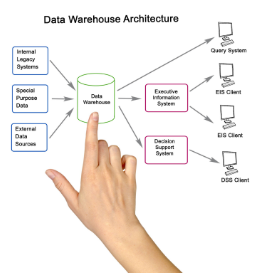

# Introducció

Arribeu a l'etapa final del projecte. Fins ara, heu treballat durament en el disseny, configuració i documentació de la infraestructura per a l'empresa **Nexus e-learning**. Heu configurat servidors, assegurat xarxes i desplegat aplicacions web. Però a la vida real, la millor solució tècnica no serveix de res si no sou capaços de vendre-la al client.

Ara toca presentar la vostra proposta. Davant vostre no tindreu professors, sinó la directiva de Nexus e-learning (CEO i CTO), que ha de decidir si aprova la vostra solució o si tria una solució de la competència.

L'objectiu no és llegir diapositives, és **convèncer que la vostra arquitectura és segura, escalable i rendible**.

---

# Descripció de l’activitat

## Format i Temps

- **Durada:** 12 minuts d'exposició + 5 minuts de preguntes del tribunal.  
- **Suport visual:** Presentació de diapositives (PDF o PowerPoint) neta, corporativa i sense text excessiu.  
  - Es valorarà l'ús de *diagrames de xarxa propis*.  
- **Codi de vestimenta:** Casual professional (eviteu roba esportiva; imagineu que aneu a una entrevista de feina).

---

## Estructura Recomanada de la Presentació

1. **Presentació de la Consultora:** Qui sou.  
2. **Anàlisi de Requisits:** Demostreu que heu entès què necessita Nexus (no tècnic).  
3. **La Solució Tècnica proposada.**  
4. **Estimació temps i cost d’implantació en el VPS seleccionat.**  
5. **Conclusions:** Per què sou la millor opció?