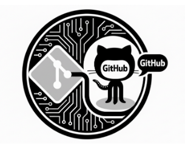

# Introducció

L’ús de GitHub i el control de versions mitjançant **git** ja és una tècnica que haveu d’haver interioritzat, per tant, no us ha d’estranyar que el repositori de GitHub sigui la base del lliurament del projecte.

A la tasca inicial del projecte, vau crear el vostre repositori a partir del repositori base proporcionat. Ara toca comprovar que el teniu llest per al lliurament.

Recordeu que cada projecte i producte ha de tenir la seva carpeta amb un criteri com **T01, T02, P01, P02**, etc.  
Dins de cada carpeta hi ha d’haver l’arxiu **README.md** (exactament amb aquest nom), on posareu una descripció de l’activitat, que pot ser l’enunciat resumit. És important que el format sigui **Markdown** i que procureu estructurar-lo en seccions.

La solució ha d’estar en un arxiu anomenat **solucio.md**, amb el codi o enllaços necessaris. Les imatges han d’estar en una carpeta.

---

# Què cal lliurar

- **Repositori assignat al GitHub Classroom**  
- No s’accepten lliuraments en repositoris diferents de l’assignat a GitHub Classroom.