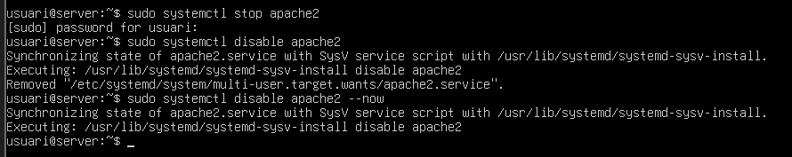
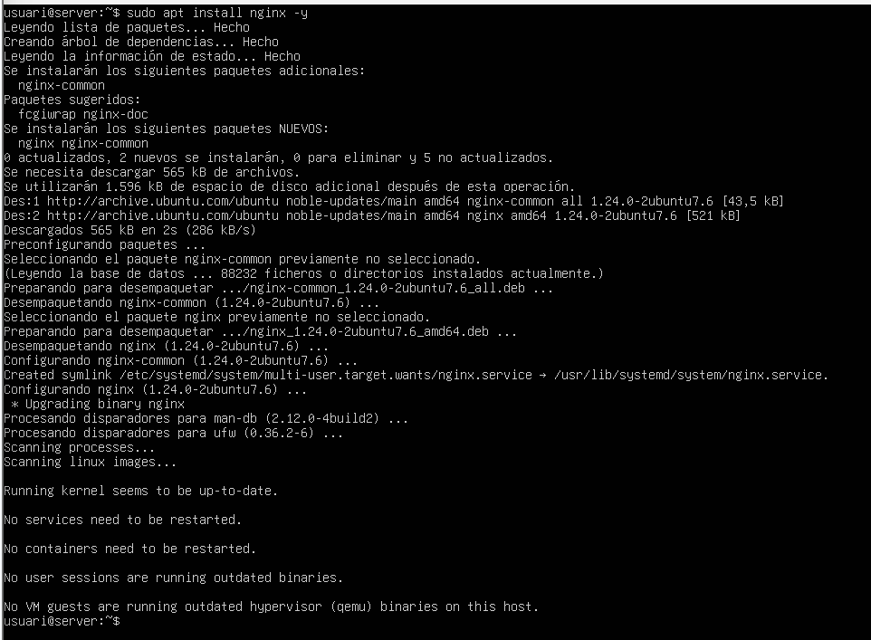
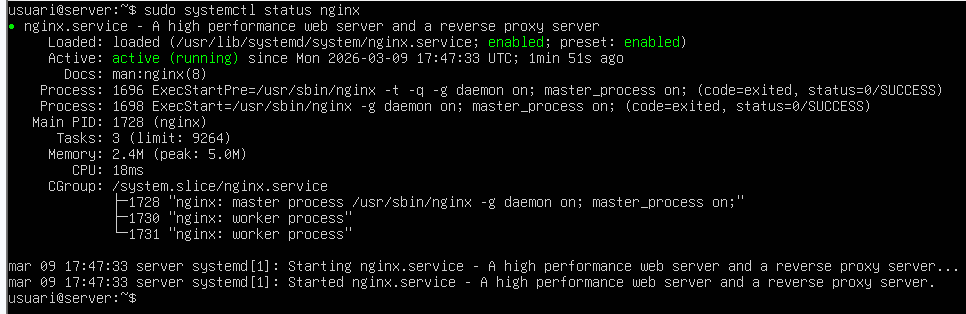
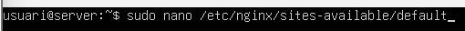
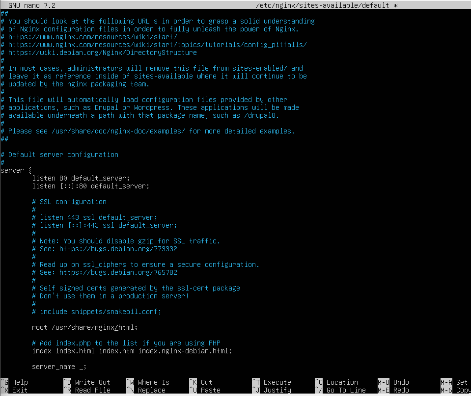
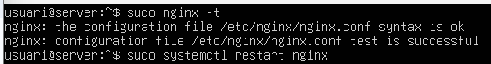
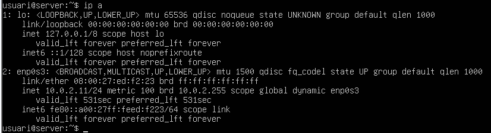
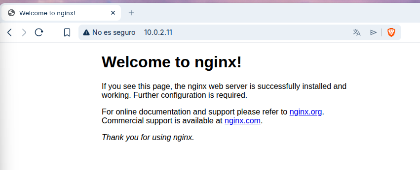

1. Preparació de l'Entorn i Instal·lació:

- Atureu i deshabiliteu el servei Apache2 per alliberar els ports 80 i 443.

- Instal·leu el servidor web Nginx.

- Verifiqueu que el servei està actiu i que la pàgina de benvinguda de Nginx es mostra correctament al navegador.

Mirem que estigui activat.

I edittem l'arxiu de configuració de default.

Ara mirem la sintaxi.

Mirem la nostra IP.

I en l'altre màquina, posem la IP en el buscador i veiem la pàgina de benvinguda de Nginx.

2. Configuració de Server Blocks (Multidomini)

- Aprofiteu l'estructura de carpetes ja creada (/var/www/nexus i /var/www/academia). Si cal, ajusteu els permisos (propietari www-data).
- Configureu dos Server Blocks (l'equivalent a VirtualHosts a Nginx) a /etc/nginx/sites-available/.
- Creeu els enllaços simbòlics a sites-enabled/ per activar les configuracions. Verifiqueu la sintaxis amb nginx -t abans de reiniciar el servei.

3. Personalització d'Errors

- Configureu la directiva error_page 404 dins del bloc de servidor corresponent.
- Assegureu-vos que, quan es demani un fitxer inexistent, es mostri la pàgina d'error personalitzada que vau crear anteriorment.

4. Seguretat i Certificats (HTTPS)
- Reutilitzeu els certificats SSL generats en l'activitat anterior (o genereu-ne de nous si cal).
- Configureu el Server Block per escoltar al port 443 i indiqueu les rutes del certificat (ssl_certificate) i la clau privada (ssl_certificate_key).
- Redirecció forçada: Configureu un bloc de servidor escoltant al port 80 queretorni un codi 301 (Permanent Redirect) cap a la versió HTTPS del domini projectenexus.test o academia.test.
5. Optimització amb HTTP/2
- Habiliteu el protocol HTTP/2 afegint el paràmetre http2 a la directiva listen del bloc SSL.
- Comproveu novament amb les eines de desenvolupador del navegador que el contingut s'està servint amb aquest protocol.
