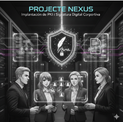

# Introducció

Un cop heu resolt el problema de la confidencialitat, Projecte Nexus ha detectat una necessitat crítica: garantir la **integritat**, **autenticitat** i el **no repudi** dels seus documents interns i contractes amb proveïdors. Fins ara signaven en paper, però volen modernitzar-se.

Us han demanat una **Prova de Concepte (PoC)** per demostrar que podeu muntar una infraestructura pròpia on els seus empleats puguin obtenir certificats digitals corporatius i signar documents PDF oficialment, sense haver de comprar certificats a tercers per a l'ús intern.

---

# Descripció de l'activitat

L'activitat es divideix en tres fases principals. Treballareu en parelles:  
- Un de vosaltres gestionarà el servidor (**Administrador de Nexus**)  
- L'altre la màquina client (**Treballador de Nexus**)  

Col·laborareu en tot el procés.

### Fase 1: Desplegament de la CA a Ubuntu Server  
### Fase 2: Sol·licitud i Emissió de Certificats pel client  
### Fase 3: Signatura Digital i Verificació (Acrobat Reader)

---

# Què cal lliurar

Al repositori del projecte, dins la carpeta corresponent a la tasca, heu de lliurar la següent feina:

## 📄 Memòria tècnica

- Format **MarkDown** i nom del fitxer: `memoria.md`.
- Captures de pantalla comentades del procés d'instal·lació de l’Autoritat de Certificació (CA) a Ubuntu Server.
- Documentació del procediment de sol·licitud del certificat client.
- Procediment de creació del certificat client.
- Instal·lació de la clau de la CA al client.
- Instal·lació del certificat client.
- Procediment de signatura d’un document PDF i comprovació.
- **Breu explicació de les diferències entre una clau pública i una clau privada** en aquest procés.

## 🖋️ Evidència de la signatura

- El fitxer PDF de prova de Nexus signat digitalment per un dels membres del grup.  
- S’haurà d’adjuntar al repositori.

## 🔐 Certificat arrel

- El fitxer `.cer` de la vostra Autoritat de Certificació (la clau pública de la CA).  
- S’haurà d’incloure al repositori per poder ser descarregat.

---

# Material de suport

- Material de l’assignatura **Seguretat Informàtica — RA3: Signatura electrònica i Certificats Digitals** (disponible al Moodle).  
- Guia de l’activitat [enllaç].