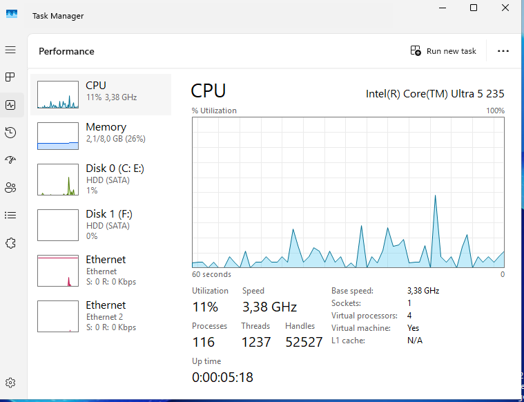
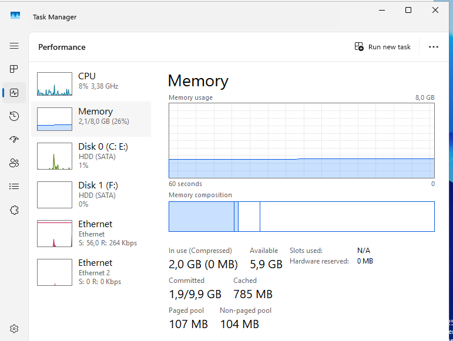
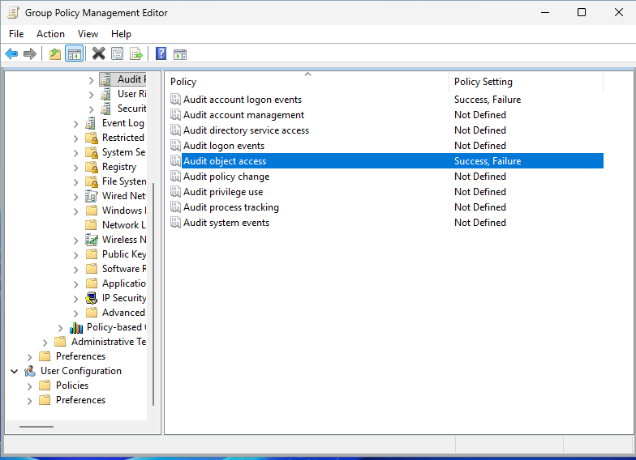

 Descripció de l'activitat

## 1. Monitorització de Recursos
- El client vol assegurar-se que el nou servidor dimensionat suporta la càrrega de treball.

- Accediu al **Monitor de Rendiment** o al **Gestor de Tasques** del servidor.
- Realitzeu una captura on es vegi clarament l'estat actual de la **CPU** i la **Memòria RAM** disponible.

- Interpreteu breument les dades: *El servidor està saturat o treballa sense estrès?*

## 2. Configuració d'Auditoria de Seguretat

- Per detectar possibles atacs de força bruta, heu d'activar el registre d'accessos.

- Configureu la **política d'auditoria** (via GPO o política local) per auditar els successos d’inici de sessió.
- Activeu tant els **èxits** (per saber qui entra) com els **fracassos** (per saber qui intenta entrar sense permís).

## 3. Simulació d'Incidents (Hacking Ètic)
Posareu a prova el sistema configurat.

- Tanqueu la sessió actual.
- Intenteu iniciar sessió amb un usuari existent, però amb **contrasenya incorrecta**.
- Repetiu el procés **3 o 4 vegades**.
- Finalment, inicieu sessió correctament com a **administrador**.

## 4. Anàlisi Forense (Event Viewer)
Actueu com a pèrits informàtics per trobar proves de l’intent d’intrusió.

- Obriu el **Visor d'Esdeveniments** (Event Viewer).
- Aneu al registre de **Seguretat**.
- Busqueu els esdeveniments que corresponguin als vostres intents fallits.
- Mostreu els detalls: usuari, hora, IP d’origen (si n’hi ha).
- **Tasca d'investigació:** Localitzeu l’**Event ID** que correspon a un *intent d’inici de sessió fallit*.

# Què cal lliurar

## Informe d'Auditoria
- Captura dels recursos del sistema amb la vostra interpretació.
- Captura de la configuració de la política d’auditoria activada.

## Evidència forense
- Captura clara del Visor d’Esdeveniments amb els errors d’inici de sessió generats.

## Resposta tècnica
- Indiqueu quin és l’**Event ID** que Windows assigna als errors d’inici de sessió.
