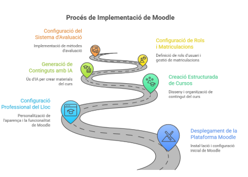

# Descripció del projecte

Ens ha encarregat el desplegament d’una **plataforma d’aprenentatge en línia** per oferir formació especialitzada a professionals del sector informàtic.

L’objectiu de l’acadèmia és oferir **formació tècnica** amb valors de:

- Sostenibilitat  
- Innovació  
- Transformació digital responsable  

Per desenvolupar aquesta plataforma, s’ha decidit utilitzar **Moodle** com a sistema de gestió d’aprenentatge (LMS).

---

# Tasques encarregades per l’empresa

L’empresa ens demana:

- El **desplegament complet** de la plataforma Moodle.  
- La **configuració professional** del lloc.  
- La **creació estructurada de dos cursos**.  
- La **generació de continguts** mitjançant eines d’IA generativa.  
- La configuració de **rols**, **matriculacions** i **sistema d’avaluació**.

---

# Requisits de la plataforma

La plataforma ha de transmetre:

- Professionalitat  
- Coherència visual  
- Orientació a empresa  

---

# Indicacions generals

Segueix les instruccions que es mostren a continuació per tal d’instal·lar, configurar i crear els cursos segons les necessitats del client.

Disposeu de les instruccions detallades en el document tècnic.

### 🔗 Enllaç al document tècnic
*(Afegeix aquí l’enllaç quan el tinguis)*