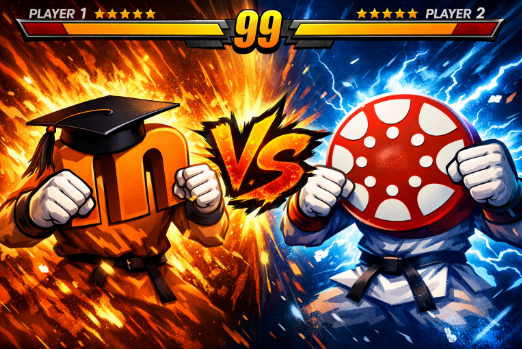

# Comparativa entre Moodle (T08) i Canvas (T09)

Un cop finalitzada la configuració de Canvas i creats els cursos, hauràs de realitzar una comparació estructurada entre:

- **Moodle (T08)**
- **Canvas (T09)**

Aquest estudi comparatiu **no pot ser només textual**. S’espera una anàlisi profunda i visual.

---

# Format d’entrega

Hauràs d’entregar **un únic document en PDF** que inclogui:

- Anàlisi textual
- Anàlisi visual amb diagrames generats amb **Napkin.ai** (obligatori)

---

# 1. Anàlisi textual

L'estudi comparatiu haurà d’analitzar de manera **argumentada i crítica**:

- Facilitat d’instal·lació  
- Arquitectura tècnica  
- Corba d’aprenentatge  
- Creació de cursos  
- Gestió d’activitats  
- Sistema d’avaluació  
- Personalització visual  
- Experiència d’usuari (docent i alumne)

⚠️ **No es permet una simple llista d’avantatges i inconvenients.**  
Cal redactar anàlisi crítica basada en l’experiència del desplegament.

---

# 2. Anàlisi visual amb Napkin.ai (OBLIGATORI)

Hauràs de generar **mínim 3 diagrames** amb Napkin.ai.  
S’han d’inserir **dins del document final**.

## Diagrama 1: Comparativa estructural

Exemple:
- Arquitectura Moodle vs Canvas  
- Components principals  
- Complexitat tècnica  

## Diagrama 2: Flux de creació d’un curs

Comparació entre:
- Passos per crear un curs a Moodle  
- Passos per crear un curs a Canvas  

Representació possible:
- Diagrama de flux  
- Esquema visual comparatiu  

## Diagrama 3: Experiència d’usuari

Incloure:
- Docent  
- Alumne  
- Administrador  

Amb indicadors visuals de:
- Simplicitat  
- Flexibilitat  
- Potència  

### Requisits dels diagrames

- Generats amb **Napkin.ai**  
- Clars i llegibles  
- Representen conceptes (no només textos literalment copiats)  
- No es permeten captures simples  

---

# 3. Reflexió final

Inclou una conclusió professional responent:

**Quina plataforma recomanaries per a:**

- Un centre educatiu?  
- Una acadèmia privada?  
- Una empresa TIC?  

Justifica la decisió **tècnicament**.

---

# Resultats esperats

Al final hauràs de tenir:

- Canvas operatiu  
- Acadèmia configurada  
- 2 cursos funcionals  
- Continguts generats amb IA  
- Usuari alumne funcional  
- Comparativa crítica amb Moodle  